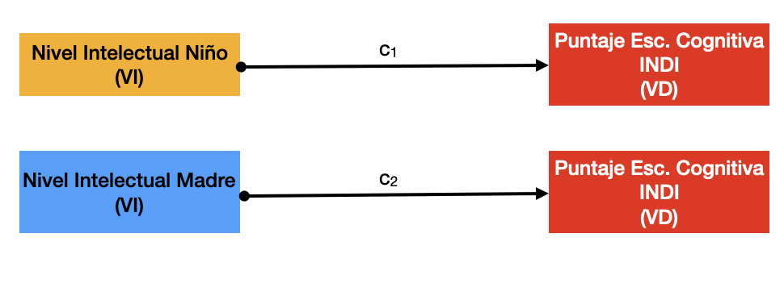
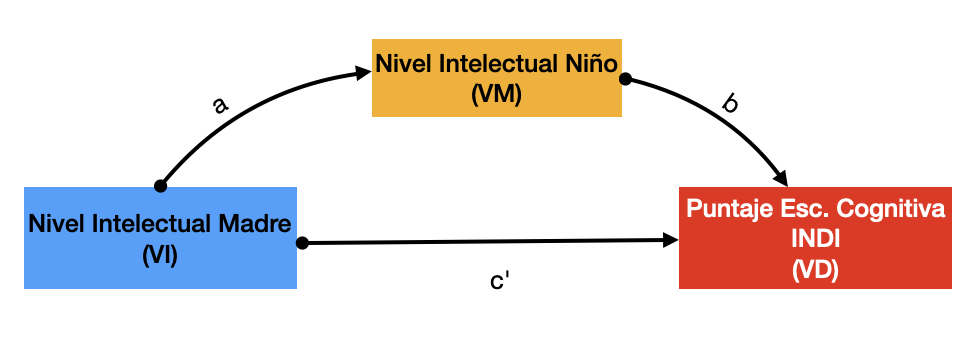
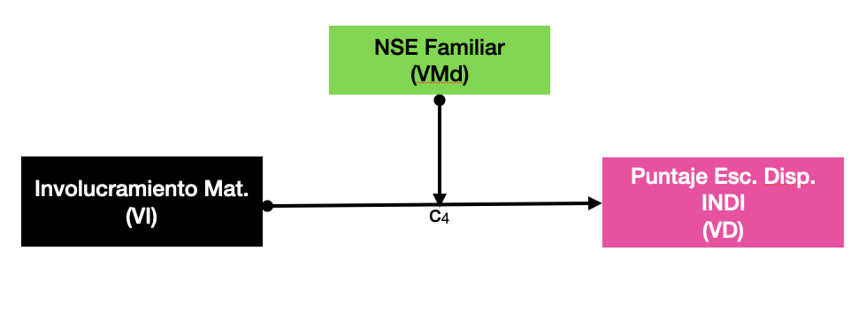

\newpage

# Introducción


En este caso, procederemos a realizar un análisis de mediación / moderación. El objetivo de esta etapa es determinar en una forma más detallada y específica la relación entre las variables independientes que en la etapa anterior descubrimos que tenían un impacto sobre las variables dependientes (puntajes en las escalas cognitiva, motora, y disposicional).

# Marco Conceptual

Antes de pasar al análisis en sí, es necesario tener muy en claro en qué consisten la mediación y la moderación en este contexto.

En general, como ya hemos mencionado al inicio de este documento, tanto mediación como moderación son formas más detalladas de describir la relación entre variables independientes (en nuestro caso, más allá de la edad, detectamos algunas variables categóricas, como el Departamento de residencia, la Región natural, etc.) y las variables dependientes (en nuestro caso, los puntajes en las escalas ya mencionadas del INDI).

## Mediación

La mediación se da cuando el efecto de una variable independiente sobre una variable dependiente depende totalmente de una tercera variable que es la que realmente intermedia entre ambas. 

Para entenderlo mejor, imaginemos que en el caso del análisis de regresión que realizamos previamente hubiéramos detectado que dos variables independientes (ficticias en este caso), llamadas "Nivel Intelectual del Niño" y "Nivel Intelectual Madre" tienen una relación estadísticamente significativa sobre, digamos, el puntaje de la Escala Cognitiva del INDI.



```{r 30_P5_DATAFRAME, echo=FALSE, message=FALSE, warning=FALSE, paged.print=FALSE, results='asis'}

library(tidyverse)
library(haven)
rm(list = ls()) 
# Carga el archivo .sav
INDI30 <- read_sav("INDI3.sav")

```

Ahora bien, en el caso de una relación de mediación, *el impacto o influencia de una de las variables independientes se debería tan solo a la variable mediadora*. Digamos que ene nuestro ejemplo, la variable "Nivel Intelectual del Niño" sería la que explicara totalmente el impacto de la variable "Nivel Intelectual de la Madre" sobre la variable dependiente "Puntaje en Esc. Cognitiva INDI".

Para usar una metáfora, es como si la influencia de las variables independientes fuera agua y toda el agua que llega de la variable independiente a la variable dependiente tuviera necesariamente que pasar por un único canal; ese canal sería la variable mediadora (VM).

En términos gráficos, sería algo así:



En este contexto:

* El impacto de la VI sobre la VM lo denominamos con la letra "a"
* El impacto de la VM sobre la VD lo denominamos con la letra "b"
* El impacto indirecto de VI sobre VD será la suma de a + b
* El impacto directo de la VI sobre VD será c'
* Si todo el impacto de la VI sobre la VD se da a través de la VM, entonces c' debería ser 0 o tender a cero.
* Si ningún impacto de la VI sobre la VD se da a través de la VM, entonces c' debería ser 1 o tender a 1.

## Moderación 

A diferencia de la mediación, en la relación de moderación la variable independiente no necesita necesariamente la intervención de una tercera variable (lo que en la mediación llamamos "VM"); aun así, existe una variable, a la que llamaremos "Moderadora" (VMd), que alterará la relación entre la VI y la VD, aunque no la cause. 

Como ejemplo, imaginemos que en el análisis de regresión detectamos que las variables "Involucramiento Materno" y "Nivel Socioecónomico Familiar" tienen impacto sobre el puntaje en la Escala Disposicional del INDI.


En este caso, vemos que, ni siquiera a nivel teórico, podríamos decir que el involucramiento maternal podría generar o causar el NSE de la familia; pero sí es concebible que el NSE influya sobre el grado en que el involucramiento de la madre impacta el puntaje obtenido por el niño: evidentemente, mientras mayores recursos económicos tenga la familia, ese involucramiento de la madre tendrá mejores posibilidades de impactar positivamente sobre el desempeño del niño.

En términos gráficos, sería algo como esto:

 

Siguiendo con la metáfora usada previamente para explicar la Mediación, en este caso la Moderación es como una perilla que aumentará o disminuirá la cantidad de "agua" que llegará a la VD según el caso, pero no es lo que produce al agua. 

## Mediación vs Moderación 

Para hablar de mediación, necesariamente la VM debe ser producida, al menos en teoría, por la VI y a su vez, debería ser, o llegar a ser, la causa de la VD. En la medida en que esto falle, no podremos ya hablar de mediación.

Para hablar de moderación, la VMd *no debe* ser causa de la VD, pero sí debe tener, en teoría, algún efecto sobre esta, que promueva o inhiba la relación entre la VI y la VD. Otros ejemplos de moderación podría ser la edad, si la VI es el ejercicio físico y la VD el nivel de sobrepeso: la edad en sí misma no puede ser resultado del ejercicio físico ni tampoco puede ocasionar el sobrepeso en sí mismo, pero sí es concebible que el impacte en la capacidad o el nivel de ejercicio que es necesario hacer para lograr un determinado peso.

\newpage

# Análisis de Mediación

En el caso concreto del presente análisis, tenemos las siguientes variables dependientes:

1. Escala Cognitiva
1. Escala Motora
1. Escala Disposicional

Como resultado del análisis de regresión ya realizado (ver parte 3), tenemos que para este caso, las variables que evidenciaron una relación estadísticamente significativa con las variables dependientes figuran en la tabla que se muestra más abajo. El punto clave es establecer si es posible conjeturar relaciones causales entre las variables independientes y las variables dependientes, según lo establecido párrafos arriba; si es así, se amerita realizar los análisis de mediación correspondientes. Si no es así, pasaríamos a realizar el Análisis de Moderación.

```{r 45_5_ResReg, echo=FALSE, message=FALSE, warning=FALSE, paged.print=FALSE, results='asis'}
library(tidyverse)
library(haven)
rm(list = ls()) 
# Carga el archivo .sav
INDI30 <- read_sav("INDI3.sav")
# Mostramos los datos tabularmente
res.reg <- c("| Escala C     | Escala M     | Escala D     |
|--------------|--------------|--------------|
| Edad         | Edad         | Edad         |
| Región       | Departamento | Región       |
| Quintil      | Quintil      | Quintil      |
| Instr. Prev. | Instr. Prev. | Instr. Prev. |
|              |              | Departamento |
|              |              | Área         |")
# Retornar la tabla con el título y los resultados en formato Markdown
  cat("### Resumen Análisis Regresión, variables independientes y variables dependientes con relación estadísticamente significativa", "\n\n") # Imprimir el título
cat(res.reg)
```
Por lo visto, podemos arriesgarnos a  determinar que no existen relaciones causales aparentes entre las variables independientes, que pudieran dar lugar a un posible análisis de mediación.

Por lo tanto, pasaremos a realizar el análisis de moderación directamente.

\newpage

# Análisis de Moderación 

## Escala Cognitiva

A continuación, pasaremos a realizar el análisis de moderación de la Edad como variable independiente sobre el desempeño en la Escala Cognitiva como variable dependiente, variando en cada caso la variable moderadora.

Cabe señalar que en esta oportunidad solo se ha usado los valores del Quintil como variable estrictamente numérica; en el resto de casos, se ha considerado el resto de variables moderadoras como variables categóricas. Esto último implica que, como en el caso del análisis de regresión, se ha debido generar variables *dummy*. Las mismas nociones que en el caso del análisis de regresión deben ser tomadas en cuenta también aquí. En especial, en el caso de las variables categóricas, la categoría que no aparece en la tabla es la categoría de referencia.

### Quintil como variable moderadora

Empezaremos por evaluar el impacto moderador del Quintil sobre el puntaje en la Escala Cognitiva.

```{r 30_P5_DATAFRAMING, echo=FALSE, message=FALSE, warning=FALSE, paged.print=FALSE, results='asis'}
# Función para extraer la data numérica sin NA's de un df

ayudin <- function(dataframe, columnas) {
  # Verificar que las columnas seleccionadas sean numéricas
  if (!all(sapply(columnas, function(col) is.numeric(dataframe[[col]])))) {
    stop("Todas las columnas seleccionadas deben ser numéricas.")
  }
  
  # Filtrar el dataframe eliminando filas con NA en las columnas seleccionadas
  dataframe_limpio <- dataframe[complete.cases(dataframe[, columnas]), columnas]
  
  # Devolver el dataframe limpio
  return(dataframe_limpio)
}
INDI30$Codigo <- as.numeric(INDI30$Codigo)
INDI30$EDADMES <- as.numeric(INDI30$EDADMES)
# Llamar a la función y mostrar los resultados
LIMPIO <- ayudin(dataframe = INDI30, columnas = c(1, 100:102))
# DF Categorial
# Función para convertir variables a factor
convert_to_factor <- function(df, indices) {
  df[indices] <- lapply(df[indices], as.factor)
  return(df)
}
# Convierto a factor

INDI30_Factor<- convert_to_factor(INDI30, c(7:8,11,13,41))
# Me quedo solo con las variables factor que han demostrado tener relación estadísticamente significativa 
library(dplyr)
INDI30_Factor <- INDI30_Factor %>% 
  dplyr::select(Codigo, EDADMES, Regnat, Reg, Quintil, Insant3a, Area)
# Fusiono con el df numérico sin NA's
PULCRO <- left_join(LIMPIO, INDI30_Factor,  by = "Codigo") # Este df solo tiene casos sin NA's y con las variables factor

# recodificando Niveles
PULCRO$Regnat<- fct_recode(PULCRO$Regnat,
                        "Costa" = "1",
                        "Sierra" = "2",
                        "Selva" = "3")

PULCRO$Reg <- fct_recode(PULCRO$Reg,
                        "Lima Met." = "Lima Metropolitana",
                        "Piura" = "Piura",
                        "Cusco" = "Cusco",
                        "Loreto" = "Loreto"
                        )

PULCRO$Area <- fct_recode(PULCRO$Area,
                        "Urbana" = "1",
                        "Rural" = "2")
PULCRO$Insant3a  <- fct_recode(PULCRO$Insant3a,
                        "No" = "0",
                        "Sí" = "1",
                        "NS/NR" = "2"
                        )

colnames(PULCRO) <- c("Código", "Escala_Cog.", "Escala_Mot.", "Escala_Dis.","Edad_Mes", "Región", "Departamento", "Quintil", "Inst_Prev.", "Area")

PULCRO$Quintil_N <- as.numeric(PULCRO$Quintil)
library(dplyr)
# write_csv(PULCRO, "PULCRO_MODERADO.csv")
# Análisis de Moderación 
# PULCRO$XEQ <- PULCRO$Edad_Mes * PULCRO$Quintil_N  # Crear variable de interacción
# 
# # Ajustar el modelo de regresión con el término de interacción
# edad.quintil.c <- lm(Escala_Cog. ~ Edad_Mes + Quintil_N + XEQ, data = PULCRO)
# 
# # Resumen del modelo
# summary(edad.quintil.c)
# library(interactions)
# # Visualización del efecto de moderación
# interact_plot(edad.quintil.c, pred = Edad_Mes, modx = Quintil_N, plot.points = TRUE)

moderation_analysis <- function(data, VI, VM, VD, color_palette) {
  
  # Cargar paquetes necesarios
  if (!requireNamespace("interactions", quietly = TRUE)) install.packages("interactions")
  if (!requireNamespace("ggplot2", quietly = TRUE)) install.packages("ggplot2")
  if (!requireNamespace("RColorBrewer", quietly = TRUE)) install.packages("RColorBrewer")
  if (!requireNamespace("knitr", quietly = TRUE)) install.packages("knitr")
  
  library(interactions)
  library(ggplot2)
  library(RColorBrewer)
  library(knitr)
  
  # Verificar que las variables sean numéricas
  if (!is.numeric(data[[VI]]) || !is.numeric(data[[VM]]) || !is.numeric(data[[VD]])) {
    stop("Todas las variables deben ser numéricas.")
  }
  
  # Crear el término de interacción
  data$Interaccion <- data[[VI]] * data[[VM]]
  
  # Ajustar el modelo de regresión
  model <- lm(as.formula(paste(VD, "~", VI, "*", VM)), data = data)
  
  # Obtener los coeficientes y p-valores
  summary_model <- summary(model)
  coef_table <- as.data.frame(summary_model$coefficients)
  colnames(coef_table) <- c("Estimado", "Error Std.", "t-valor", "p-valor")
  
  # Eliminar nombres de fila para evitar la duplicación
  coef_table <- tibble::rownames_to_column(coef_table, var = "Término")
  
  # Formatear p-valores con asteriscos
  coef_table$Significancia <- ifelse(coef_table$`p-valor` < 0.001, "***",
                                     ifelse(coef_table$`p-valor` < 0.01, "**",
                                            ifelse(coef_table$`p-valor` < 0.05, "*", "NS")))
  
  # Seleccionar columnas relevantes
  coef_table <- coef_table[, c("Término", "Estimado", "Significancia")]
  
  # Generar la tabla en Markdown para PDF/HTML
  tabla_md <- kable(coef_table, format = "markdown", digits = 3,
                     caption = paste("Resultados de Moderación entre VI", VI, ", VM", VM, "y VD", VD))
  
  # Retornar tabla en Markdown (se imprimirá automáticamente en RMarkdown)
  print(tabla_md)
  
  # Gráfico de interacción
  plot_title <- paste("Visualización de Efecto de Moderación entre VI", VI, ", VM", VM, "y VD", VD)
  
  interact_plot(model, pred = !!rlang::sym(VI), modx = !!rlang::sym(VM),
                plot.points = TRUE, colors = brewer.pal(3, color_palette)) +
    theme_gray() +
    ggtitle(plot_title)
}


# Llamar a la función
moderation_analysis(PULCRO, VI = "Edad_Mes", VM = "Quintil_N", VD = "Escala_Cog.", color_palette = "Set1")
```
**Conclusiones**

- Los niños de hogares más pobres (Quintil 1) muestran un mayor incremento en su Escala Cognitiva con la edad en comparación con los niños en quintiles más altos.
- Los niños en mejores condiciones económicas (quintiles más altos) tienen, en general, una puntuación cognitiva mayor desde el inicio (efecto principal positivo de Quintil_N), pero su tasa de desarrollo con la edad es menor (interacción negativa).
- Esto podría indicar que los niños en situaciones de mayor pobreza experimentan un desarrollo acelerado con la edad, mientras que los niños en mejor situación económica ya comienzan con puntuaciones más altas y su progreso es más estable a lo largo del tiempo.
- Los niños en pobreza podrían estar en una etapa de “recuperación” en sus primeros años, donde el desarrollo cognitivo se acelera con el tiempo.
- Los niños en quintiles más altos pueden tener un acceso temprano a estímulos cognitivos, por lo que su desarrollo es más constante y menos dependiente de la edad.

\newpage

### Región como Variable moderadora

A continuación, se analiza el modelo de moderación según el cual la variable dependiente Escala Cognitiva es influenciada por la variable independiente Edad en Meses, siendo la variable moderadora la Región (Costa, Sierra y Selva).

Cabe mencionar que para el caso de la variable moderadora Departamento se ha tomado como valor de referencia la categoría *Costa*; esto significa que ese valor en particular no aparece en la tabla, sino que debe asumirse que está presente cuando no mencionan ningún departamento. Ello es importante tenerlo en mente para el caso de las interpretaciones de los resultados, como a continuación veremos.

```{r 30_P5_Mod_Cat_Region2, echo=FALSE, message=FALSE, warning=FALSE, paged.print=FALSE, results='asis'}
analisis_moderacion_cat3 <- function(dataframe, vi, vm, vd, color_brewer) {
  # Cargar paquetes requeridos
  require(ggplot2)
  require(RColorBrewer)
  require(boot)
  require(car)
  
  # Crear fórmula del modelo
  formula_modelo <- paste(vd, "~", vi, "*", vm)
  
  # Función para bootstrapping
  boot_fn <- function(data, indices) {
    sample_data <- data[indices,]
    modelo <- lm(formula_modelo, data = sample_data)
    return(coef(modelo))
  }
  
  # Ejecutar bootstrap (1000 réplicas)
  set.seed(123)
  resultados_boot <- boot(dataframe, boot_fn, R = 1000)
  
  # Calcular intervalos de confianza
  ci <- t(sapply(1:ncol(resultados_boot$t), function(i) 
    boot.ci(resultados_boot, type = "bca", index = i)$bca[4:5]))
  
  # Modelo original para valores p
  modelo_original <- lm(formula_modelo, data = dataframe)
  sumario <- summary(modelo_original)
  
  # Crear tabla de resultados
  tabla_resultados <- data.frame(
    Termino = rownames(sumario$coefficients),
    Estimado = sumario$coefficients[,1],
    p_valor = sumario$coefficients[,4],
    LI = ci[,1],
    LS = ci[,2],
    row.names = NULL  # Eliminar nombres de fila automáticos
  )
  
  # Formatear valores p y términos
  tabla_resultados$Significancia <- cut(tabla_resultados$p_valor,
    breaks = c(-Inf, 0.001, 0.01, 0.05, Inf),
    labels = c("***", "**", "*", "NS"))
  
  # Mejorar legibilidad de los términos
  tabla_resultados$Termino <- gsub(":", " × ", tabla_resultados$Termino)
  tabla_resultados$Termino <- gsub(paste0("^", vm), paste0(vm, ": "), tabla_resultados$Termino)
  
  # Crear tabla markdown
  tabla_md <- knitr::kable(
    tabla_resultados[,c("Termino", "Estimado", "Significancia")],
    col.names = c("Término", "Estimado", "p-valor"),
    align = c("l", "r", "r"),
    caption = paste("Resultados de Moderación entre VI", vi, 
                   ", VM", vm, ", y VD", vd),
    row.names = FALSE  # Corrección clave para nombres duplicados
  )
  
  # Crear gráfico
  colores <- brewer.pal(nlevels(dataframe[[vm]]), color_brewer)
  
  grafico <- ggplot(dataframe, aes(x = .data[[vi]], y = .data[[vd]], 
                                  color = .data[[vm]])) +
    geom_point(alpha = 0.6) +
    geom_smooth(method = "lm", se = FALSE) +
    scale_color_manual(values = colores) +
    labs(title = paste("Efecto de Moderación entre VI", vi,
                      "VM", vm, "y VD", vd),
         x = vi, y = vd, color = vm) +
    theme_minimal()
  
  return(list(Tabla = tabla_md, Grafico = grafico))
}

mod.reg.age.c <- analisis_moderacion_cat3(PULCRO, "Edad_Mes", "Región", "Escala_Cog.", "Set2")
print(mod.reg.age.c$Tabla)
print(mod.reg.age.c$Grafico)

```

**Conclusiones:**

- En la Costa, la edad influye significativamente en el desarrollo cognitivo (+0.88 puntos por mes).
- Los niños de la Sierra y la Selva tienen puntuaciones iniciales significativamente más bajas que los de la Costa (-49 y -48 puntos, respectivamente).
- El desarrollo con la edad en la Selva es mayor que en la Costa (+0.79, p < 0.05), mientras que en la Sierra no hay una diferencia clara en la tasa de desarrollo.
- Los niños en la Selva pueden estar en una situación de desventaja inicial, pero su desarrollo cognitivo podría acelerarse con el tiempo.
- En la Sierra, el rezago en la puntuación cognitiva no parece compensarse con la edad, lo que sugiere una brecha persistente con la Costa.
- Esto podría estar relacionado con diferencias en acceso a educación, estimulación temprana, nutrición o calidad del entorno en las distintas regiones.

\newpage

### Departamento como Variable moderadora 

A continuación, se analiza el modelo de moderación según el cual la variable dependiente Escala Cognitiva es influenciada por la variable independiente Edad en Meses, siendo la variable moderadora Departamento.

Cabe mencionar que para el caso de la variable moderadora Departamento se ha tomado como valor de referencia el *Departamento del Cusco*; esto significa que ese valor en particular no aparece en la tabla, sino que debe asumirse que está presente cuando no mencionan ningún departamento. Ello es importante tenerlo en mente para el caso de las interpretaciones de los resultados, como a continuación veremos.

```{r 30_P5_Dep_Cat_Modalidad2, echo=FALSE, message=FALSE, warning=FALSE, paged.print=FALSE, results='asis'}


mod.dep.age.c <- analisis_moderacion_cat3(PULCRO, "Edad_Mes", "Departamento", "Escala_Cog.", "Blues")
print(mod.dep.age.c$Tabla)
print(mod.dep.age.c$Grafico)
```

\newpage

**Conclusiones**

- En Cusco, la edad influye significativamente en el desarrollo cognitivo (+1.20 puntos por mes).
- Los niños en Lima Metropolitana tienen puntuaciones cognitivas mucho más altas (+72.22 puntos, p < 0.001) que los de Cusco, aunque su tasa de desarrollo con la edad es más lenta.
- No hay evidencia estadística fuerte de que los niños en Loreto y Piura tengan puntuaciones cognitivas significativamente diferentes de las del Cusco.
- La interacción significativa en Lima Met. sugiere que, aunque los niños en Lima tienen una ventaja cognitiva inicial, su desarrollo es más estable y menos dependiente de la edad en comparación con Cusco.
- Los niños en Lima podrían tener un acceso temprano a mejores oportunidades educativas y estímulos cognitivos, lo que explicaría su gran ventaja inicial.
- El menor desarrollo con la edad en Lima podría deberse a un “techo” en el desarrollo cognitivo, donde las ventajas iniciales reducen la necesidad de incrementos acelerados con la edad.
- En Cusco, el desarrollo es mayor, lo que podría indicar que los niños están en una fase de recuperación de oportunidades a medida que crecen.
- El hecho de que Loreto y Piura no sean significativamente diferentes de Cusco podría indicar que existen otros factores estructurales que afectan el desarrollo cognitivo en estos departamentos.

\newpage

### Instrucción Previa al Nivel 3 como Variable moderadora 

A continuación, se analiza el modelo de moderación según el cual la variable dependiente Escala Cognitiva es influenciada por la variable independiente Edad en Meses, siendo la variable moderadora la Instrucción Previa al Nivel 3.

Cabe mencionar que para el caso de la variable moderadora Instrucción Previa al Nivel 3 se ha tomado como valor de referencia la categoría *No*; esto significa que ese valor en particular no aparece en la tabla, sino que debe asumirse que está presente cuando no mencionan ningún departamento. Ello es importante tenerlo en mente para el caso de las interpretaciones de los resultados, como a continuación veremos.

```{r 30_P5_Edad_Cat_EDuMat2, echo=FALSE, message=FALSE, warning=FALSE, paged.print=FALSE, results='asis'}
# Aquí hubo un problema con la función de cálculo de la moderación, porque el bootstrapping se rompía debido a que había iteraciones donde determinadas variables dummy no aparecían. Se tuve que corrwegir la función, de modo que se creó una función similar para estos casos específicos.


mod.inst3.age.c <- analisis_moderacion_cat3(PULCRO, "Edad_Mes", "Inst_Prev.", "Escala_Cog.", "Blues")
print(mod.inst3.age.c$Tabla)
print(mod.inst3.age.c$Grafico)
```

**Conclusiones**

- La edad tiene un efecto positivo y significativo en la Escala Cognitiva para los niños sin instrucción previa (+1.62 puntos por mes).
- Los niños que tuvieron instrucción previa al Nivel 3 (nido o educación inicial) tienen en promedio 31 puntos más en la Escala Cognitiva que los que no asistieron (p < 0.05).
- No hay evidencia estadística de que la relación entre la edad y el desarrollo cognitivo sea diferente entre los grupos de instrucción previa.
- Los niños en la categoría "NS/NR" no presentan diferencias significativas respecto a los niños sin instrucción previa.
 
\newpage


### Área como Variable moderadora 

A continuación, se analiza el modelo de moderación según el cual la variable dependiente Escala Cognitiva es influenciada por la variable independiente Edad en Meses, siendo la variable moderadora Área.

Cabe mencionar que para el caso de la variable moderadora Área se ha tomado como valor de referencia la categoría *Urbana*; esto significa que ese valor en particular no aparece en la tabla, sino que debe asumirse que está presente cuando no mencionan ningún departamento. Ello es importante tenerlo en mente para el caso de las interpretaciones de los resultados, como a continuación veremos.

```{r 30_P5_Edad_Cat_Area, echo=FALSE, message=FALSE, warning=FALSE, paged.print=FALSE, results='asis'}
# Aquí hubo un problema con la función de cálculo de la moderación, porque el bootstrapping se rompía debido a que había iteraciones donde determinadas variables dummy no aparecían. Se tuve que corrwegir la función, de modo que se creó una función similar para estos casos específicos.


mod.area.age.c <- analisis_moderacion_cat3(PULCRO, "Edad_Mes", "Area", "Escala_Cog.", "Blues")
print(mod.area.age.c$Tabla)
print(mod.area.age.c$Grafico)
```

**Conclusiones**

- En las zonas urbanas, la Escala Cognitiva aumenta en 1.26 puntos por mes, y este efecto es altamente significativo.
- Los niños en áreas rurales tienen puntuaciones cognitivas significativamente más bajas que los de zonas urbanas (-35.68 puntos en promedio, p < 0.05).

 
\newpage

## Escala Motora

A continuación, pasaremos a realizar el análisis de moderación de la Edad como variable independiente sobre el desempeño en la Escala Motora como variable dependiente, variando en cada caso la variable moderadora.

Cabe señalar que en esta oportunidad solo se ha usado los valores del Quintil como variable estrictamente numérica; en el resto de casos, se ha considerado el resto de variables moderadoras como variables categóricas. Esto último implica que, como en el caso del análisis de regresión, se ha debido generar variables *dummy*. Las mismas nociones que en el caso del análisis de regresión deben ser tomadas en cuenta también aquí. En especial, en el caso de las variables categóricas, la categoría que no aparece en la tabla es la categoría de referencia.

### Quintil como variable moderadora

Empezaremos por evaluar el impacto moderador del Quintil sobre el puntaje en la Escala Motora.

```{r 30_P5_Quintil_Motora, echo=FALSE, message=FALSE, warning=FALSE, paged.print=FALSE, results='asis'}
# Llamar a la función
moderation_analysis(PULCRO, VI = "Edad_Mes", VM = "Quintil_N", VD = "Escala_Mot.", color_palette = "Greens")
```

\newpage

**Conclusiones**

- En el Quintil 1 (mayor pobreza), la Escala Motora aumenta significativamente con la edad (+0.661 puntos por mes, p < 0.001).
- No hay evidencia estadística de que la Escala Motora varíe significativamente entre quintiles de pobreza cuando la edad es constante.
- No hay evidencia de que la relación entre la edad y la Escala Motora cambie en función del quintil de pobreza.
- El desarrollo motor parece estar más influenciado por la edad que por el nivel socioeconómico.
- El hecho de que la diferencia entre quintiles no sea significativa sugiere que factores individuales (como educación en el hogar o acceso a servicios) pueden ser más importantes que la categoría socioeconómica general.
- La falta de significancia en la interacción implica que la tasa de desarrollo motriz con la edad es similar en todos los quintiles de pobreza.

\newpage

### Departamento como Variable moderadora 

A continuación, se analiza el modelo de moderación según el cual la variable dependiente Escala Motora es influenciada por la variable independiente Edad en Meses, siendo la variable moderadora Departamento.

Cabe mencionar que para el caso de la variable moderadora Departamento se ha tomado como valor de referencia el *Departamento del Cusco*; esto significa que ese valor en particular no aparece en la tabla, sino que debe asumirse que está presente cuando no mencionan ningún departamento. Ello es importante tenerlo en mente para el caso de las interpretaciones de los resultados, como a continuación veremos.

```{r 30_P5_Dep_Cat_Mot_Modalidad2, echo=FALSE, message=FALSE, warning=FALSE, paged.print=FALSE, results='asis'}
mod.dep.age.m <- analisis_moderacion_cat3(PULCRO, "Edad_Mes", "Departamento", "Escala_Mot.", "Greens")
print(mod.dep.age.m$Tabla)
print(mod.dep.age.m$Grafico)
```

\newpage

**Conclusiones**

- La edad tiene un efecto positivo y significativo en la Escala Motora en Cusco (+0.395 puntos por mes, p < 0.01).
- No hay evidencia estadística de que los niños en Lima, Loreto o Piura tengan puntuaciones significativamente diferentes en la Escala Motora en comparación con los niños en Cusco cuando la edad es constante.
- No hay evidencia de que la relación entre la edad y la Escala Motora varíe en función del departamento.
- El desarrollo motor parece estar impulsado principalmente por la edad, sin diferencias claras entre departamentos.
- Aunque Lima Metropolitana muestra una tendencia a mejores puntuaciones motoras y Piura una tendencia a menores puntuaciones, la falta de significancia estadística sugiere que estas diferencias pueden ser producto del azar o de factores no controlados.
- El acceso a espacios de juego, actividad física y nutrición podría ser más importante para el desarrollo motor que la ubicación geográfica en sí misma.

\newpage

### Instrucción Previa al Nivel 3 como Variable moderadora 

A continuación, se analiza el modelo de moderación según el cual la variable dependiente Escala Cognitiva es influenciada por la variable independiente Edad en Meses, siendo la variable moderadora la Instrucción Previa al Nivel 3.

Cabe mencionar que para el caso de la variable moderadora Instrucción Previa al Nivel 3 se ha tomado como valor de referencia la categoría *No*; esto significa que ese valor en particular no aparece en la tabla, sino que debe asumirse que está presente cuando no mencionan ningún departamento. Ello es importante tenerlo en mente para el caso de las interpretaciones de los resultados, como a continuación veremos.

```{r 30_P5_Edad_Cat_Mot_Insta3, echo=FALSE, message=FALSE, warning=FALSE, paged.print=FALSE, results='asis'}
# Aquí hubo un problema con la función de cálculo de la moderación, porque el bootstrapping se rompía debido a que había iteraciones donde determinadas variables dummy no aparecían. Se tuve que corrwegir la función, de modo que se creó una función similar para estos casos específicos.


mod.inst3.age.m <- analisis_moderacion_cat3(PULCRO, "Edad_Mes", "Inst_Prev.", "Escala_Mot.", "Greens")
print(mod.inst3.age.m$Tabla)
print(mod.inst3.age.m$Grafico)
```

**Conclusiones**

- La edad tiene un efecto positivo y significativo en la Escala Motora (+0.569 puntos por mes, p < 0.001).
- No hay evidencia estadística de que la instrucción previa al nivel inicial tenga un impacto significativo en la Escala Motora cuando la edad es constante.
- No hay evidencia de que la relación entre la edad y la Escala Motora varíe en función de la instrucción previa.
- El desarrollo motor parece estar impulsado principalmente por la edad, sin diferencias claras entre los niños con o sin instrucción previa.
- El hecho de que la instrucción previa no tenga un efecto significativo sugiere que otros factores, como el entorno familiar, el acceso a juegos o actividades físicas, podrían ser más determinantes en el desarrollo motor que la educación inicial.
- Podría ser útil explorar otros factores que podrían moderar la relación entre la edad y la Escala Motora, como la nutrición, la actividad física o el nivel socioeconómico.
 
\newpage

## Escala Disposicional

A continuación, pasaremos a realizar el análisis de moderación de la Edad como variable independiente sobre el desempeño en la Escala Disposicional como variable dependiente, variando en cada caso la variable moderadora.

Cabe señalar que en esta oportunidad solo se ha usado los valores del Quintil como variable estrictamente numérica; en el resto de casos, se ha considerado el resto de variables moderadoras como variables categóricas. Esto último implica que, como en el caso del análisis de regresión, se ha debido generar variables *dummy*. Las mismas nociones que en el caso del análisis de regresión deben ser tomadas en cuenta también aquí. En especial, en el caso de las variables categóricas, la categoría que no aparece en la tabla es la categoría de referencia.

### Quintil como variable moderadora

Empezaremos por evaluar el impacto moderador del Quintil sobre el puntaje en la Escala Disposicional.

```{r 30_P5_Quintil_Disp, echo=FALSE, message=FALSE, warning=FALSE, paged.print=FALSE, results='asis'}
# Llamar a la función
moderation_analysis(PULCRO, VI = "Edad_Mes", VM = "Quintil_N", VD = "Escala_Dis.", color_palette = "Oranges")
```
\newpage

**Conclusiones**

- La Escala Disposicional aumenta significativamente con la edad en todos los quintiles (+0.460 puntos por mes en el Quintil 1, p < 0.001).
- Los niños en quintiles de menor pobreza tienen puntuaciones disposicionales más altas que los niños en el Quintil 1, incluso cuando la edad es constante (+4.775 puntos, p < 0.01).
- Sin embargo, el desarrollo con la edad es más lento en los quintiles más altos (-0.075 por unidad de quintil, p < 0.05), lo que sugiere que la brecha entre grupos podría reducirse con el tiempo.
- Los niños en mejores condiciones socioeconómicas inician con una ventaja disposicional, lo que podría estar relacionado con un mayor acceso a recursos educativos, apoyo familiar o entornos más estructurados.
- Sin embargo, los niños en pobreza parecen experimentar un desarrollo más acelerado en la Escala Disposicional a medida que crecen, lo que podría reflejar procesos de adaptación, resiliencia o intervenciones compensatorias en el tiempo.
- A largo plazo, la diferencia inicial en disposición entre quintiles podría disminuir, ya que los niños más pobres están cerrando la brecha con el tiempo.

\newpage

### Región como Variable moderadora

A continuación, se analiza el modelo de moderación según el cual la variable dependiente Escala Cognitiva es influenciada por la variable independiente Edad en Meses, siendo la variable moderadora la Región (Costa, Sierra y Selva).

Cabe mencionar que para el caso de la variable moderadora Departamento se ha tomado como valor de referencia la categoría *Costa*; esto significa que ese valor en particular no aparece en la tabla, sino que debe asumirse que está presente cuando no mencionan ningún departamento. Ello es importante tenerlo en mente para el caso de las interpretaciones de los resultados, como a continuación veremos.

```{r 30_P5_Mod_Cat_D_Region2, echo=FALSE, message=FALSE, warning=FALSE, paged.print=FALSE, results='asis'}


mod.reg.age.d <- analisis_moderacion_cat3(PULCRO, "Edad_Mes", "Región", "Escala_Dis.", "Oranges")
print(mod.reg.age.d$Tabla)
print(mod.reg.age.d$Grafico)

```

**Conclusiones:**

- Los niños en Cusco tienen una puntuación inicial alta en la Escala Disposicional (23.29 puntos).
- Los niños en la Sierra tienen puntuaciones disposicionales mucho más bajas (-20.52 puntos), pero su desarrollo con la edad es significativamente más acelerado (+0.387 puntos por mes, p < 0.001).
- Los niños en la Selva no presentan diferencias significativas con los de Cusco en términos de disposición inicial ni en la forma en que la edad afecta su desarrollo.
- En Cusco, la edad no parece jugar un papel importante en el desarrollo disposicional (p > 0.05).

\newpage

### Instrucción Previa al Nivel 3 como Variable moderadora 

A continuación, se analiza el modelo de moderación según el cual la variable dependiente Escala Cognitiva es influenciada por la variable independiente Edad en Meses, siendo la variable moderadora la Instrucción Previa al Nivel 3.

Cabe mencionar que para el caso de la variable moderadora Instrucción Previa al Nivel 3 se ha tomado como valor de referencia la categoría *No*; esto significa que ese valor en particular no aparece en la tabla, sino que debe asumirse que está presente cuando no mencionan ningún departamento. Ello es importante tenerlo en mente para el caso de las interpretaciones de los resultados, como a continuación veremos.

```{r 30_P5_Edad_Cat_D_EDuMat2, echo=FALSE, message=FALSE, warning=FALSE, paged.print=FALSE, results='asis'}
# Aquí hubo un problema con la función de cálculo de la moderación, porque el bootstrapping se rompía debido a que había iteraciones donde determinadas variables dummy no aparecían. Se tuve que corrwegir la función, de modo que se creó una función similar para estos casos específicos.


mod.inst3.age.d <- analisis_moderacion_cat3(PULCRO, "Edad_Mes", "Inst_Prev.", "Escala_Dis.", "Oranges")
print(mod.inst3.age.d$Tabla)
print(mod.inst3.age.d$Grafico)
```

**Conclusiones**

- La edad tiene un efecto positivo y significativo en la Escala Disposicional (+0.18 puntos por mes, p < 0.001).
- No hay evidencia estadística de que la instrucción previa tenga un impacto significativo en la Escala Disposicional cuando la edad es constante.
- No hay evidencia de que la relación entre la edad y la Escala Disposicional varíe en función de la instrucción previa.
 
\newpage

### Departamento como Variable moderadora 

A continuación, se analiza el modelo de moderación según el cual la variable dependiente Escala Disposicional es influenciada por la variable independiente Edad en Meses, siendo la variable moderadora Departamento.

Cabe mencionar que para el caso de la variable moderadora Departamento se ha tomado como valor de referencia el *Departamento del Cusco*; esto significa que ese valor en particular no aparece en la tabla, sino que debe asumirse que está presente cuando no mencionan ningún departamento. Ello es importante tenerlo en mente para el caso de las interpretaciones de los resultados, como a continuación veremos.

```{r 30_P5_Dep_Cat_D2, echo=FALSE, message=FALSE, warning=FALSE, paged.print=FALSE, results='asis'}


mod.dep.age.d <- analisis_moderacion_cat3(PULCRO, "Edad_Mes", "Departamento", "Escala_Dis.", "Oranges")
print(mod.dep.age.d$Tabla)
print(mod.dep.age.d$Grafico)
```

\newpage

**Conclusiones**

- La Escala Disposicional aumenta con la edad en Cusco (+0.276 puntos por mes, p < 0.01).
- Los niños en Lima Metropolitana tienen puntuaciones disposicionales significativamente más altas que los de Cusco (+19.90 puntos, p < 0.001).
- Sin embargo, el desarrollo disposicional con la edad en Lima es más lento que en Cusco (-0.338 puntos por mes, p < 0.01), lo que sugiere que la brecha inicial se reduce con el tiempo.
- No hay evidencia de diferencias significativas en la Escala Disposicional entre Cusco y los niños de Loreto o Piura, ni de que la edad tenga un impacto diferente en estas regiones.

\newpage

### Área como Variable moderadora 

A continuación, se analiza el modelo de moderación según el cual la variable dependiente Escala Disposicional es influenciada por la variable independiente Edad en Meses, siendo la variable moderadora Área.

Cabe mencionar que para el caso de la variable moderadora Área se ha tomado como valor de referencia la categoría *Urbana*; esto significa que ese valor en particular no aparece en la tabla, sino que debe asumirse que está presente cuando no mencionan ningún departamento. Ello es importante tenerlo en mente para el caso de las interpretaciones de los resultados, como a continuación veremos.

```{r 30_P5_Edad_Cat_D_Area, echo=FALSE, message=FALSE, warning=FALSE, paged.print=FALSE, results='asis'}
# Aquí hubo un problema con la función de cálculo de la moderación, porque el bootstrapping se rompía debido a que había iteraciones donde determinadas variables dummy no aparecían. Se tuve que corrwegir la función, de modo que se creó una función similar para estos casos específicos.


mod.area.age.d <- analisis_moderacion_cat3(PULCRO, "Edad_Mes", "Area", "Escala_Dis.", "Oranges")
print(mod.area.age.d$Tabla)
print(mod.area.age.d$Grafico)
```

**Conclusiones**

- En las zonas urbanas, la Escala Disposicional aumenta significativamente con la edad (+0.169 puntos por mes, p < 0.001).
- No hay evidencia estadística suficiente para afirmar que los niños en zonas rurales tengan un nivel Disposicional significativamente menor que los niños urbanos cuando la edad es constante.
- No hay evidencia de que el desarrollo disposicional con la edad sea diferente en niños urbanos y rurales.

 
\newpage

