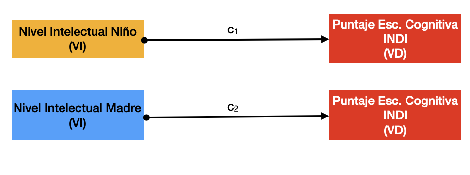
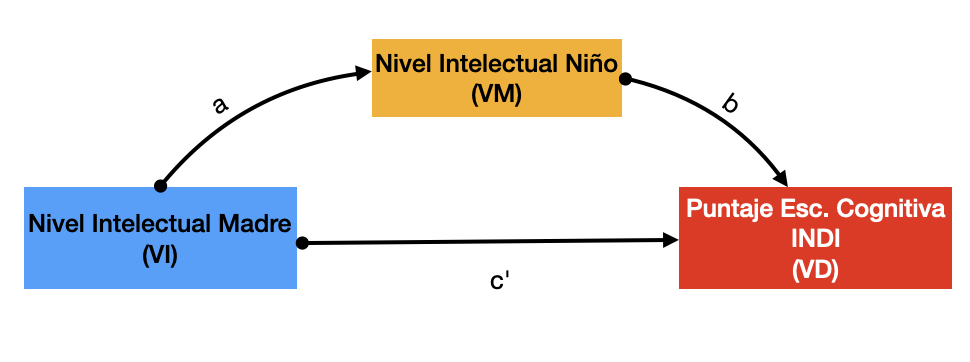
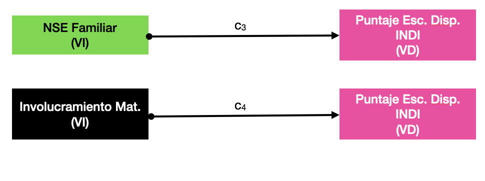

\newpage

# Introducción


En este caso, procederemos a realizar un análisis de mediación / moderación. El objetivo de esta etapa es determinar en una forma más detallada y específica la relación entre las variables independientes que en la etapa anterior descubrimos que tenían un impacto sobre las variables dependientes (puntajes en las escalas cognitiva, motora, y disposicional).

# Marco Conceptual

Antes de pasar al análisis en sí, es necesario tener muy en claro en qué consisten la mediación y la moderación en este contexto.

En general, como ya hemos mencionado al inicio de este documento, tanto mediación como moderación son formas más detalladas de describir la relación entre variables independientes (en nuestro caso, más allá de la edad, detectamos algunas variables categóricas, como el Departamento de residencia, la Región natural, etc.) y las variables dependientes (en nuestro caso, los puntajes en las escalas ya mencionadas del INDI).

## Mediación

La mediación se da cuando el efecto de una variable independiente sobre una variable dependiente depende totalmente de una tercera variable que es la que realmente intermedia entre ambas. 

Para entenderlo mejor, imaginemos que en el caso del análisis de regresión que realizamos previamente hubiéramos detectado que dos variables independientes (ficticias en este caso), llamadas "Nivel Intelectual del Niño" y "Nivel Intelectual Madre" tienen una relación estadísticamente significativa sobre, digamos, el puntaje de la Escala Cognitiva del INDI.



```{r 45_P5_DATAFRAME, echo=FALSE, message=FALSE, warning=FALSE, paged.print=FALSE, results='asis'}

library(tidyverse)
library(haven)
rm(list = ls()) 
# Carga el archivo .sav
INDI45 <- read_sav("INDI45.sav")

```

Ahora bien, en el caso de una relación de mediación, *el impacto o influencia de una de las variables independientes se debería tan solo a la variable mediadora*. Digamos que ene nuestro ejemplo, la variable "Nivel Intelectual del Niño" sería la que explicara totalmente el impacto de la variable "Nivel Intelectual de la Madre" sobre la variable dependiente "Puntaje en Esc. Cognitiva INDI".

Para usar una metáfora, es como si la influencia de las variables independientes fuera agua y toda el agua que llega de la variable independiente a la variable dependiente tuviera necesariamente que pasar por un único canal; ese canal sería la variable mediadora (VM).

En términos gráficos, sería algo así:



En este contexto:

* El impacto de la VI sobre la VM lo denominamos con la letra "a"
* El impacto de la VM sobre la VD lo denominamos con la letra "b"
* El impacto indirecto de VI sobre VD será la suma de a + b
* El impacto directo de la VI sobre VD será c'
* Si todo el impacto de la VI sobre la VD se da a través de la VM, entonces c' debería ser 0 o tender a cero.
* Si ningún impacto de la VI sobre la VD se da a través de la VM, entonces c' debería ser 1 o tender a 1.

## Moderación 

A diferencia de la mediación, en la relación de moderación la variable independiente no necesita necesariamente la intervención de una tercera variable (lo que en la mediación llamamos "VM"); aun así, existe una variable, a la que llamaremos "Moderadora" (VMd), que alterará la relación entre la VI y la VD, aunque no la cause. 

Como ejemplo, imaginemos que en el análisis de regresión detectamos que las variables "Involucramiento Materno" y "Nivel Socioecónomico Familiar" tienen impacto sobre el puntaje en la Escala Disposicional del INDI.



En este caso, vemos que, ni siquiera a nivel teórico, podríamos decir que el involucramiento maternal podría generar o causar el NSE de la familia; pero sí es concebible que el NSE influya sobre el grado en que el involucramiento de la madre impacta el puntaje obtenido por el niño: evidentemente, mientras mayores recursos económicos tenga la familia, ese involucramiento de la madre tendrá mejores posibilidades de impactar positivamente sobre el desempeño del niño.

En términos gráficos, sería algo como esto:

 

Siguiendo con la metáfora usada previamente para explicar la Mediación, en este caso la Moderación es como una perilla que aumentará o disminuirá la cantidad de "agua" que llegará a la VD según el caso, pero no es lo que produce al agua. 

## Mediación vs Moderación 

Para hablar de mediación, necesariamente la VM debe ser producida, al menos en teoría, por la VI y a su vez, debería ser, o llegar a ser, la causa de la VD. En la medida en que esto falle, no podremos ya hablar de mediación.

Para hablar de moderación, la VMd *no debe* ser causa de la VD, pero sí debe tener, en teoría, algún efecto sobre esta, que promueva o inhiba la relación entre la VI y la VD. Otros ejemplos de moderación podría ser la edad, si la VI es el ejercicio físico y la VD el nivel de sobrepeso: la edad en sí misma no puede ser resultado del ejercicio físico ni tampoco puede ocasionar el sobrepeso en sí mismo, pero sí es concebible que el impacte en la capacidad o el nivel de ejercicio que es necesario hacer para lograr un determinado peso.

\newpage

# Análisis de Mediación

En el caso concreto del presente análisis, tenemos las siguientes variables dependientes:

1. Escala Cognitiva
1. Escala Motora
1. Escala Disposicional

Como resultado del análisis de regresión ya realizado (ver parte 3), tenemos que para este caso, las variables que evidenciaron una relación estadísticamente significativa con las variables dependientes figuran en la tabla que se muestra más abajo. El punto clave es establecer si es posible conjeturar relaciones causales entre las variables independientes y las variables dependientes, según lo establecido párrafos arriba; si es así, se amerita realizar los análisis de mediación correspondientes. Si no es así, pasaríamos a realizar el Análisis de Moderación.

```{r 45_5_ResReg, echo=FALSE, message=FALSE, warning=FALSE, paged.print=FALSE, results='asis'}
library(tidyverse)
library(haven)
rm(list = ls()) 
# Carga el archivo .sav
INDI45 <- read_sav("INDI45.sav")
# Mostramos los datos tabularmente
res.reg <- c("|   Escala C      |   Escala M      |   Escala D      |
|-----------------|-----------------|-----------------|
|   Edad          |   Edad          |   Edad          |
|   Departamento  |   Departamento  |   Departamento  |
|   Quintil       |   Quintil       |   Quintil       |
|   Educ. Mat.    |   Educ. Mat.    |   Educ. Mat.    |
|                 |   Modalidad     |   Modalidad     |
|                 |   Región        |                 |")
# Retornar la tabla con el título y los resultados en formato Markdown
  cat("### Resumen Análisis Regresión, variables independientes y variables dependientes con relación estadísticamente significativa", "\n\n") # Imprimir el título
cat(res.reg)
```
Por lo visto, podemos arriesgarnos a  determinar que no existen relaciones causales aparentes entre las variables independientes, que pudieran dar lugar a un posible análisis de mediación.

Por lo tanto, pasaremos a realizar el análisis de moderación directamente.

\newpage

# Análisis de Moderación 

## Escala Cognitiva

A continuación, pasaremos a realizar el análisis de moderación de la Edad como variable independiente sobre el desempeño en la Escala Cognitiva como variable dependiente, variando en cada caso la variable moderadora.

Cabe señalar que en esta oportunidad solo se ha usado los valores del Quintil como variable estrictamente numérica; en el resto de casos, se ha considerado el resto de variables moderadoras como variables categóricas. Esto último implica que, como en el caso del análisis de regresión, se ha debido generar variables *dummy*. Las mismas nociones que en el caso del análisis de regresión deben ser tomadas en cuenta también aquí. En especial, en el caso de las variables categóricas, la categoría que no aparece en la tabla es la categoría de referencia.

### Quintil como variable moderadora

Empezaremos por evaluar el impacto moderador del Quintil sobre el puntaje en la Escala Cognitiva.

```{r 45_P5_DATAFRAMING, echo=FALSE, message=FALSE, warning=FALSE, paged.print=FALSE, results='asis'}
# Función para extraer la data numérica sin NA's de un df

ayudin <- function(dataframe, columnas) {
  # Verificar que las columnas seleccionadas sean numéricas
  if (!all(sapply(columnas, function(col) is.numeric(dataframe[[col]])))) {
    stop("Todas las columnas seleccionadas deben ser numéricas.")
  }
  
  # Filtrar el dataframe eliminando filas con NA en las columnas seleccionadas
  dataframe_limpio <- dataframe[complete.cases(dataframe[, columnas]), columnas]
  
  # Devolver el dataframe limpio
  return(dataframe_limpio)
}

# Llamar a la función y mostrar los resultados
LIMPIO <- ayudin(dataframe = INDI45, columnas = c(1, 102:104))
# DF Categorial
# Función para convertir variables a factor
convert_to_factor <- function(df, indices) {
  df[indices] <- lapply(df[indices], as.factor)
  return(df)
}
# Convierto a factor

INDI45_Factor<- convert_to_factor(INDI45, c(7,9,11,13,19))
# Me quedo solo con las variables factor que han demostrado tener relación estadísticamente significativa 
library(dplyr)
INDI45_Factor <- INDI45_Factor %>% 
  dplyr::select(Codigo, EDADMES, Regnat, Nivmod, Reg, Quintil, Grainsmad)
# Fusiono con el df numérico sin NA's
PULCRO <- left_join(LIMPIO, INDI45_Factor,  by = "Codigo") # Este df solo tiene casos sin NA's y con las variables factor

# recodificando Niveles
PULCRO$Regnat<- fct_recode(PULCRO$Regnat,
                        "Costa" = "1",
                        "Sierra" = "2",
                        "Selva" = "3")
PULCRO$Nivmod <- fct_recode(PULCRO$Nivmod,
                        "Jardín" = "Inicial - Jardín",
                        "No_Esc" = "Inicial - Programa no escolarizado",
                        "Cuna-Jardín" = "Inicial - Cuna-jardín"
                        )
PULCRO$Reg <- fct_recode(PULCRO$Reg,
                        "Lima Met." = "Lima Metropolitana",
                        "Piura" = "Piura",
                        "Cusco" = "Cusco",
                        "Loreto" = "Loreto"
                        )
colnames(PULCRO) <- c("Código", "Escala_Cog.", "Escala_Mot.", "Escala_Dis.","Edad_Mes", "Región", "Modalidad", "Departamento", "Quintil", "Inst_Mat.")
PULCRO$Inst_Mat. <- fct_relevel(PULCRO$Inst_Mat., "Ninguno", "Inicial", "Primaria incompleto", "Primaria completo", "Secundaria incompleto", "Secundaria completo","Superior técnico incompleto", "Superior técnico completo","Superior universitario incompleto","Superior universitario completo","Posgrado (maestría, doctorado)")
PULCRO$Inst_Mat_N <- fct_recode(PULCRO$Inst_Mat.,
                        "1" = "Ninguno",
                        "2" = "Inicial",
                        "3" = "Primaria incompleto",
                        "4" = "Primaria completo",
                        "5" = "Secundaria incompleto",
                        "6" = "Secundaria completo",
                        "7" = "Superior técnico incompleto",
                        "8" = "Superior técnico completo",
                        "9" = "Superior universitario incompleto",
                        "10" = "Superior universitario completo",
                        "11" = "Posgrado (maestría, doctorado)"
                        )
PULCRO$Inst_Mat_N <- as.numeric(PULCRO$Inst_Mat_N)
PULCRO$Quintil_N <- as.numeric(PULCRO$Quintil)
library(dplyr)

PULCRO <- PULCRO %>% 
  filter(Modalidad != "No_Esc")
# write_csv(PULCRO, "PULCRO_MODERADO.csv")
# Análisis de Moderación 
# PULCRO$XEQ <- PULCRO$Edad_Mes * PULCRO$Quintil_N  # Crear variable de interacción
# 
# # Ajustar el modelo de regresión con el término de interacción
# edad.quintil.c <- lm(Escala_Cog. ~ Edad_Mes + Quintil_N + XEQ, data = PULCRO)
# 
# # Resumen del modelo
# summary(edad.quintil.c)
# library(interactions)
# # Visualización del efecto de moderación
# interact_plot(edad.quintil.c, pred = Edad_Mes, modx = Quintil_N, plot.points = TRUE)

moderation_analysis <- function(data, VI, VM, VD, color_palette) {
  
  # Cargar paquetes necesarios
  if (!requireNamespace("interactions", quietly = TRUE)) install.packages("interactions")
  if (!requireNamespace("ggplot2", quietly = TRUE)) install.packages("ggplot2")
  if (!requireNamespace("RColorBrewer", quietly = TRUE)) install.packages("RColorBrewer")
  if (!requireNamespace("knitr", quietly = TRUE)) install.packages("knitr")
  
  library(interactions)
  library(ggplot2)
  library(RColorBrewer)
  library(knitr)
  
  # Verificar que las variables sean numéricas
  if (!is.numeric(data[[VI]]) || !is.numeric(data[[VM]]) || !is.numeric(data[[VD]])) {
    stop("Todas las variables deben ser numéricas.")
  }
  
  # Crear el término de interacción
  data$Interaccion <- data[[VI]] * data[[VM]]
  
  # Ajustar el modelo de regresión
  model <- lm(as.formula(paste(VD, "~", VI, "*", VM)), data = data)
  
  # Obtener los coeficientes y p-valores
  summary_model <- summary(model)
  coef_table <- as.data.frame(summary_model$coefficients)
  colnames(coef_table) <- c("Estimado", "Error Std.", "t-valor", "p-valor")
  coef_table$Término <- rownames(coef_table)
  
  # Formatear p-valores con asteriscos
  coef_table$Significancia <- ifelse(coef_table$`p-valor` < 0.001, "***",
                                     ifelse(coef_table$`p-valor` < 0.01, "**",
                                            ifelse(coef_table$`p-valor` < 0.05, "*", "NS")))
  
  # Seleccionar columnas relevantes
  coef_table <- coef_table[, c("Término", "Estimado", "Significancia")]
  
  # Generar la tabla en Markdown para PDF/HTML
  tabla_md <- kable(coef_table, format = "markdown", digits = 3,
                     caption = paste("Resultados de Moderación entre VI", VI, ", VM", VM, "y VD", VD))
  
  # Retornar tabla en Markdown (se imprimirá automáticamente en RMarkdown)
  print(tabla_md)
  
  # Gráfico de interacción
  plot_title <- paste("Visualización de Efecto de Moderación entre VI", VI, ", VM", VM, "y VD", VD)
  
  interact_plot(model, pred = !!sym(VI), modx = !!sym(VM),
                plot.points = TRUE, colors = brewer.pal(3, color_palette)) +
    theme_gray() +
    ggtitle(plot_title)
}


# Llamar a la función
moderation_analysis(PULCRO, VI = "Edad_Mes", VM = "Quintil_N", VD = "Escala_Cog.", color_palette = "Set1")
```
Según podemos comprobar en la Tabla y gráfico previos, el Quintil no parece tener un impacto estadísticamente significativo sobre la Escala Cognitiva. En especial, término de interacción (Edad_Mes:Quintil_N) no es estadísticamente significativo.

\newpage

### Región como Variable moderadora

A continuación, se analiza el modelo de moderación según el cual la variable dependiente Escala Cognitiva es influenciada por la variable independiente Edad en Meses, siendo la variable moderadora la Región (Costa, Sierra y Selva).

Cabe mencionar que para el caso de la variable moderadora Departamento se ha tomado como valor de referencia la categoría *Costa*; esto significa que ese valor en particular no aparece en la tabla, sino que debe asumirse que está presente cuando no mencionan ningún departamento. Ello es importante tenerlo en mente para el caso de las interpretaciones de los resultados, como a continuación veremos.

```{r 45_P5_Mod_Cat_Region2, echo=FALSE, message=FALSE, warning=FALSE, paged.print=FALSE, results='asis'}
analisis_moderacion_cat3 <- function(dataframe, vi, vm, vd, color_brewer) {
  # Cargar paquetes requeridos
  require(ggplot2)
  require(RColorBrewer)
  require(boot)
  require(car)
  
  # Crear fórmula del modelo
  formula_modelo <- paste(vd, "~", vi, "*", vm)
  
  # Función para bootstrapping
  boot_fn <- function(data, indices) {
    sample_data <- data[indices,]
    modelo <- lm(formula_modelo, data = sample_data)
    return(coef(modelo))
  }
  
  # Ejecutar bootstrap (1000 réplicas)
  set.seed(123)
  resultados_boot <- boot(dataframe, boot_fn, R = 1000)
  
  # Calcular intervalos de confianza
  ci <- t(sapply(1:ncol(resultados_boot$t), function(i) 
    boot.ci(resultados_boot, type = "bca", index = i)$bca[4:5]))
  
  # Modelo original para valores p
  modelo_original <- lm(formula_modelo, data = dataframe)
  sumario <- summary(modelo_original)
  
  # Crear tabla de resultados
  tabla_resultados <- data.frame(
    Termino = rownames(sumario$coefficients),
    Estimado = sumario$coefficients[,1],
    p_valor = sumario$coefficients[,4],
    LI = ci[,1],
    LS = ci[,2],
    row.names = NULL  # Eliminar nombres de fila automáticos
  )
  
  # Formatear valores p y términos
  tabla_resultados$Significancia <- cut(tabla_resultados$p_valor,
    breaks = c(-Inf, 0.001, 0.01, 0.05, Inf),
    labels = c("***", "**", "*", "NS"))
  
  # Mejorar legibilidad de los términos
  tabla_resultados$Termino <- gsub(":", " × ", tabla_resultados$Termino)
  tabla_resultados$Termino <- gsub(paste0("^", vm), paste0(vm, ": "), tabla_resultados$Termino)
  
  # Crear tabla markdown
  tabla_md <- knitr::kable(
    tabla_resultados[,c("Termino", "Estimado", "Significancia")],
    col.names = c("Término", "Estimado", "p-valor"),
    align = c("l", "r", "r"),
    caption = paste("Resultados de Moderación entre VI", vi, 
                   ", VM", vm, ", y VD", vd),
    row.names = FALSE  # Corrección clave para nombres duplicados
  )
  
  # Crear gráfico
  colores <- brewer.pal(nlevels(dataframe[[vm]]), color_brewer)
  
  grafico <- ggplot(dataframe, aes(x = .data[[vi]], y = .data[[vd]], 
                                  color = .data[[vm]])) +
    geom_point(alpha = 0.6) +
    geom_smooth(method = "lm", se = FALSE) +
    scale_color_manual(values = colores) +
    labs(title = paste("Efecto de Moderación entre VI", vi,
                      "VM", vm, "y VD", vd),
         x = vi, y = vd, color = vm) +
    theme_minimal()
  
  return(list(Tabla = tabla_md, Grafico = grafico))
}

mod.reg.age.c <- analisis_moderacion_cat3(PULCRO, "Edad_Mes", "Región", "Escala_Cog.", "Set2")
print(mod.reg.age.c$Tabla)
print(mod.reg.age.c$Grafico)

```

**Conclusiones:**

Los resultados anterior nos indican que la región (Costa, Sierra, Selva) no tiene un impacto moderador estadísticamente significativo sobre el efecto de la Edad en Meses.

\newpage

### Modalidad como Variable moderadora 

A continuación, se analiza el modelo de moderación según el cual la variable dependiente Escala Cognitiva es influenciada por la variable independiente Edad en Meses, siendo la variable moderadora la Modalidad.

Cabe mencionar que para el caso de la variable moderadora Modalidad se ha tomado como valor de referencia la categoría *Cuna-Jardín*; esto significa que ese valor en particular no aparece en la tabla, sino que debe asumirse que está presente cuando no mencionan ningún departamento. Ello es importante tenerlo en mente para el caso de las interpretaciones de los resultados, como a continuación veremos.

```{r 45_P5_Mod_Cat_Modalidad2, echo=FALSE, message=FALSE, warning=FALSE, paged.print=FALSE, results='asis'}


mod.modalidad.age.c <- analisis_moderacion_cat3(PULCRO, "Edad_Mes", "Modalidad", "Escala_Cog.", "Dark2")
print(mod.modalidad.age.c$Tabla)
print(mod.modalidad.age.c$Grafico)
```

**Conclusión:**

- En la modalidad *Cuna-Jardín*, la relación entre Edad y la Escala Cognitiva no es significativa (p = NS), lo que sugiere que, en esa modalidad, el desarrollo cognitivo no varía mucho con la edad.

- En la modalidad *Jardín*, los resultados sugieren que los niños tienen en promedio una puntuación significativamente más baja en la Escala Cognitiva a edades menores (esto se puede inferir de la significación estadística del intercepto), con una diferencia de -62.04 puntos respecto a los niños en "Cuna-Jardín" (p < 0.001). Cabe mencionar que tal valor es meramente teórico y desprendido matemáticamente del modelo; no significa necesariamente que ese valor se dé en la realidad concreta.

- Sin embargo, entre los participantes con Modalidad *Jardín*, el efecto de la edad es positivo y fuerte; mientras que en *Cuna-Jardín* la edad no tiene un efecto significativo sobre la Escala Cognitiva, en *Jardín* cada mes adicional de edad incrementa la Escala Cognitiva en 1.05 puntos más que en *Cuna-Jardín* (p < 0.001).

- Esto sugiere una posible diferencia en los patrones de desarrollo cognitivo: los niños en *Jardín* pueden comenzar con un desempeño más bajo, pero su desarrollo cognitivo se acelera más rápidamente a medida que crecen. En comparación, los niños en *Cuna-Jardín* pueden tener un mejor punto de partida, pero su desarrollo cognitivo es más estable.

\newpage

### Departamento como Variable moderadora 

A continuación, se analiza el modelo de moderación según el cual la variable dependiente Escala Cognitiva es influenciada por la variable independiente Edad en Meses, siendo la variable moderadora Departamento.

Cabe mencionar que para el caso de la variable moderadora Departamento se ha tomado como valor de referencia el *Departamento del Cusco*; esto significa que ese valor en particular no aparece en la tabla, sino que debe asumirse que está presente cuando no mencionan ningún departamento. Ello es importante tenerlo en mente para el caso de las interpretaciones de los resultados, como a continuación veremos.

```{r 45_P5_Dep_Cat_Modalidad2, echo=FALSE, message=FALSE, warning=FALSE, paged.print=FALSE, results='asis'}


mod.dep.age.c <- analisis_moderacion_cat3(PULCRO, "Edad_Mes", "Departamento", "Escala_Cog.", "Blues")
print(mod.dep.age.c$Tabla)
print(mod.dep.age.c$Grafico)
```

\newpage

**Conclusiones**

- En Cusco, la Escala Cognitiva aumenta 0.51 puntos por cada mes de edad, lo que indica un desarrollo cognitivo positivo con el tiempo.  

- Los niños en Piura comienzan con una puntuación significativamente más baja (`-49.36` puntos respecto a Cusco), pero su crecimiento cognitivo es mucho más acelerado con la edad (`+0.93` puntos adicionales por mes).  

- En Loreto, la relación entre Edad y Escala Cognitiva es más fuerte que en Cusco** (`+0.49` puntos adicionales por mes, `p < 0.05`), aunque las diferencias iniciales en la Escala Cognitiva no son significativas.  

- En Lima Metropolitana, no hay diferencias significativas ni en la puntuación inicial ni en el crecimiento cognitivo con la edad en comparación con Cusco.  

\newpage

### Instrucción Materna como Variable moderadora 

A continuación, se analiza el modelo de moderación según el cual la variable dependiente Escala Cognitiva es influenciada por la variable independiente Edad en Meses, siendo la variable moderadora la Instrucción Materna.

Cabe mencionar que para el caso de la variable moderadora Instrucción Materna se ha tomado como valor de referencia la categoría *Cuna-Jardín*; esto significa que ese valor en particular no aparece en la tabla, sino que debe asumirse que está presente cuando no mencionan ningún departamento. Ello es importante tenerlo en mente para el caso de las interpretaciones de los resultados, como a continuación veremos.

```{r 45_P5_Edad_Cat_EDuMat2, echo=FALSE, message=FALSE, warning=FALSE, paged.print=FALSE, results='asis'}
# Aquí hubo un problema con la función de cálculo de la moderación, porque el bootstrapping se rompía debido a que había iteraciones donde determinadas variables dummy no aparecían. Se tuve que corrwegir la función, de modo que se creó una función similar para estos casos específicos.

analisis_moderacion_catinfini <- function(dataframe, vi, vm, vd, color_brewer = "Set3") {
  # Cargar paquetes requeridos
  require(ggplot2)
  require(RColorBrewer)
  require(boot)
  require(car)
  require(viridisLite)  # Para manejar más colores si es necesario
  
  # Crear fórmula del modelo
  formula_modelo <- as.formula(paste(vd, "~", vi, "*", vm))
  
  # Extraer nombres de coeficientes esperados
  modelo_prueba <- lm(formula_modelo, data = dataframe)
  coef_nombres <- names(coef(modelo_prueba))
  
  # Función para bootstrapping con control de errores
  boot_fn <- function(data, indices) {
    sample_data <- data[indices, ]
    modelo <- tryCatch(lm(formula_modelo, data = sample_data), error = function(e) NULL)
    
    if (is.null(modelo)) {
      return(rep(NA, length(coef_nombres)))  # Devolver NAs si falla el modelo
    }
    
    coefs <- coef(modelo)
    
    # Asegurar que todos los coeficientes tengan el mismo orden
    coefs_completos <- rep(NA, length(coef_nombres))
    names(coefs_completos) <- coef_nombres
    coefs_completos[names(coefs)] <- coefs
    
    return(coefs_completos)
  }
  
  # Ejecutar bootstrap (1000 réplicas)
  set.seed(123)
  resultados_boot <- boot(dataframe, boot_fn, R = 1000)
  
  # Calcular intervalos de confianza
  ci <- t(sapply(1:length(coef_nombres), function(i) 
    boot.ci(resultados_boot, type = "bca", index = i)$bca[4:5]))

  # Modelo original para valores p
  modelo_original <- lm(formula_modelo, data = dataframe)
  sumario <- summary(modelo_original)
  
  # Crear tabla de resultados
  tabla_resultados <- data.frame(
    Termino = coef_nombres,
    Estimado = sumario$coefficients[,1],
    p_valor = sumario$coefficients[,4],
    LI = ci[,1],
    LS = ci[,2],
    row.names = NULL  # Eliminar nombres de fila automáticos
  )
  
  # Formatear valores p y términos
  tabla_resultados$Significancia <- cut(tabla_resultados$p_valor,
    breaks = c(-Inf, 0.001, 0.01, 0.05, Inf),
    labels = c("***", "**", "*", "NS"))
  
  # Mejorar legibilidad de los términos
  tabla_resultados$Termino <- gsub(":", " × ", tabla_resultados$Termino)
  tabla_resultados$Termino <- gsub(paste0("^", vm), paste0(vm, ": "), tabla_resultados$Termino)
  
  # Crear tabla markdown
  tabla_md <- knitr::kable(
    tabla_resultados[,c("Termino", "Estimado", "Significancia")],
    col.names = c("Término", "Estimado", "p-valor"),
    align = c("l", "r", "r"),
    caption = paste("Resultados de Moderación entre VI", vi, 
                   "VM", vm, "y VD", vd),
    row.names = FALSE  # Corrección clave para nombres duplicados
  )
  
  # Seleccionar colores adecuados
  num_categorias <- length(unique(dataframe[[vm]]))
  
  if (num_categorias <= brewer.pal.info[color_brewer, "maxcolors"]) {
    colores <- brewer.pal(num_categorias, color_brewer)
  } else {
    colores <- viridis(num_categorias)  # Usa paleta Viridis si hay demasiadas categorías
  }
  
  # Crear gráfico
  grafico <- ggplot(dataframe, aes(x = .data[[vi]], y = .data[[vd]], 
                                  color = .data[[vm]])) +
    geom_point(alpha = 0.6) +
    geom_smooth(method = "lm", se = FALSE) +
    scale_color_manual(values = colores) +
    labs(title = paste("Efecto de Moderación entre VI", vi,
                      ", VM", vm, ", y VD", vd),
         x = vi, y = vd, color = vm) +
    theme_minimal()
  
  return(list(Tabla = tabla_md, Grafico = grafico))
}


mod.eduma.age.c <- analisis_moderacion_catinfini(PULCRO, "Edad_Mes", "Inst_Mat.", "Escala_Cog.", "Set3")
print(mod.eduma.age.c$Tabla)
print(mod.eduma.age.c$Grafico)
```

**Conclusiones**

- Los niños con madres con cualquier nivel de educación obtienen un mejor desempeño inicial en la Escala Cognitiva en comparación con las madres sin ninguna instrucción.  
- Las madres con educación inicial (`+199.54 *`), superior universitaria completa (`+158.24 ***`) y técnica (`+149.99 **`) presentan los mayores efectos positivos. Esto sugiere que el nivel educativo materno está fuertemente asociado con ventajas iniciales en el desarrollo cognitivo.
- Sin embargo, la tasa de crecimiento de la Escala Cognitiva con la edad es más baja para los niños con madres con mayor educación.  
- Los coeficientes de interacción negativos sugieren que, aunque estos niños comienzan con una ventaja, su desarrollo cognitivo con la edad es más lento en comparación con los niños cuyas madres no tienen ninguna educación formal.  
- Ejemplo: Niños con madres con "Primaria incompleta" (`-2.23 **`) muestran un crecimiento significativamente menor en comparación con la categoría de referencia. 
- Las interacciones no significativas (por ejemplo "Superior universitario incompleto", "Posgrado") indican que en estos grupos la diferencia con el desempeño de los participantes cuyas madres no tienen nivel educativo alguno no es clara.
 
\newpage

## Escala Motora

A continuación, pasaremos a realizar el análisis de moderación de la Edad como variable independiente sobre el desempeño en la Escala Motora como variable dependiente, variando en cada caso la variable moderadora.

Cabe señalar que en esta oportunidad solo se ha usado los valores del Quintil como variable estrictamente numérica; en el resto de casos, se ha considerado el resto de variables moderadoras como variables categóricas. Esto último implica que, como en el caso del análisis de regresión, se ha debido generar variables *dummy*. Las mismas nociones que en el caso del análisis de regresión deben ser tomadas en cuenta también aquí. En especial, en el caso de las variables categóricas, la categoría que no aparece en la tabla es la categoría de referencia.

### Quintil como variable moderadora

Empezaremos por evaluar el impacto moderador del Quintil sobre el puntaje en la Escala Motora.

```{r 45_P5_Quintil_Motora, echo=FALSE, message=FALSE, warning=FALSE, paged.print=FALSE, results='asis'}
# Llamar a la función
moderation_analysis(PULCRO, VI = "Edad_Mes", VM = "Quintil_N", VD = "Escala_Mot.", color_palette = "Greens")
```

\newpage

**Conclusiones**

- La edad tiene un efecto positivo en la Escala Motora (0.145 **), indicando que el desarrollo motor mejora a medida que los niños crecen. (Lo cual es de esperar a nivel teórico, dada la influencia de la maduración sobre el desempeño motriz.)

- El nivel de Quintil_N por sí solo no tiene un impacto significativo en la Escala Motora (-1.406, NS).

- Sin embargo, Quintil_N modera la relación entre Edad_Mes y la Escala Motora (0.032 *), lo que sugiere que los niños en quintiles más altos tienen una tasa de desarrollo motor más rápida con la edad en comparación con los de quintiles más bajos. Esto puede deberse al impacto de un ambiente de mayor estimulación en el caso de los participantes pertenecientes a quintiles superiores.

- El crecimiento motor es positivo con la edad para todos los niños, pero parece acelerarse más en quintiles más altos.

- El pertenecer al nivel socioeconómico más bajo (Quintil_N) no afecta directamente la Escala Motora, pero influye en la velocidad del desarrollo con el tiempo.

- Esto podría sugerir que los niños en quintiles más bajos pueden requerir intervenciones para estimular el desarrollo motor en etapas tempranas.

\newpage

### Región como Variable moderadora

A continuación, se analiza el modelo de moderación según el cual la variable dependiente Escala Motora es influenciada por la variable independiente Edad en Meses, siendo la variable moderadora la Región (Costa, Sierra y Selva).

Cabe mencionar que para el caso de la variable moderadora Departamento se ha tomado como valor de referencia la categoría *Costa*; esto significa que ese valor en particular no aparece en la tabla, sino que debe asumirse que está presente cuando no mencionan ningún departamento. Ello es importante tenerlo en mente para el caso de las interpretaciones de los resultados, como a continuación veremos.

```{r 45_P5_Mot_Cat_Region2, echo=FALSE, message=FALSE, warning=FALSE, paged.print=FALSE, results='asis'}
mod.reg.age.m <- analisis_moderacion_cat3(PULCRO, "Edad_Mes", "Región", "Escala_Mot.", "Greens")
print(mod.reg.age.m$Tabla)
print(mod.reg.age.m$Grafico)
```

**Conclusiones**

- Los niños de la Sierra y la Selva tienen un mejor desempeño inicial en la Escala Motora en comparación con los niños de la Costa.

- Los niños de la Sierra comienzan con una ventaja de +10.64 puntos y los de la Selva con +9.73 puntos. Esto podría deberse a diferencias en el ambiente físico, actividades diarias o factores culturales que favorecen el desarrollo motor temprano en estas regiones.

- Sin embargo, el desarrollo motor con la edad es más lento en la Sierra y la Selva que en la Costa. En la Sierra, cada mes adicional suma 0.21 puntos menos en comparación con la Costa. En la Selva, cada mes adicional suma 0.17 puntos menos en comparación con la Costa.
Esto sugiere que, aunque los niños en la Sierra y la Selva comienzan con un desarrollo motor más avanzado, los niños en la Costa los alcanzan progresivamente con la edad.

- El ambiente físico y las actividades diarias podrían explicar la ventaja inicial en el desarrollo motor de los niños de la Sierra y la Selva.

- Sin embargo, la Costa parece ofrecer condiciones que favorecen un crecimiento más sostenido con la edad.

- Estos hallazgos pueden ser relevantes para diseñar estrategias de estimulación motora en cada región.

\newpage

### Modalidad como Variable moderadora 

A continuación, se analiza el modelo de moderación según el cual la variable dependiente Escala Motora es influenciada por la variable independiente Edad en Meses, siendo la variable moderadora la Modalidad.

Cabe mencionar que para el caso de la variable moderadora Modalidad se ha tomado como valor de referencia la categoría *Cuna-Jardín*; esto significa que ese valor en particular no aparece en la tabla, sino que debe asumirse que está presente cuando no mencionan ningún departamento. Ello es importante tenerlo en mente para el caso de las interpretaciones de los resultados, como a continuación veremos.

```{r 45_P5_Motriz_Cat_Modalidad2, echo=FALSE, message=FALSE, warning=FALSE, paged.print=FALSE, results='asis'}
mod.modalidad.age.m <- analisis_moderacion_cat3(PULCRO, "Edad_Mes", "Modalidad", "Escala_Mot.", "Greens")
print(mod.modalidad.age.m$Tabla)
print(mod.modalidad.age.m$Grafico)
```

**Conclusiones**

- En "Cuna-Jardín", la Escala Motora mejora significativamente con la edad (0.24 ***), lo que indica un crecimiento positivo en el desarrollo motor con el tiempo.

- No hay diferencias significativas en la puntuación inicial de la Escala Motora entre los niños en "Jardín" y "Cuna-Jardín" (-0.19, NS), lo que sugiere que los valores son similares en ambas modalidades.

- El efecto de la edad sobre el desarrollo motor no varía entre las modalidades (0.027, NS), lo que indica que estar en "Jardín" o en "Cuna-Jardín" no cambia significativamente la velocidad de mejora en la Escala Motora con la edad.

\newpage

### Departamento como Variable moderadora 

A continuación, se analiza el modelo de moderación según el cual la variable dependiente Escala Motora es influenciada por la variable independiente Edad en Meses, siendo la variable moderadora Departamento.

Cabe mencionar que para el caso de la variable moderadora Departamento se ha tomado como valor de referencia el *Departamento del Cusco*; esto significa que ese valor en particular no aparece en la tabla, sino que debe asumirse que está presente cuando no mencionan ningún departamento. Ello es importante tenerlo en mente para el caso de las interpretaciones de los resultados, como a continuación veremos.

```{r 45_P5_Dep_Cat_Mot_Modalidad2, echo=FALSE, message=FALSE, warning=FALSE, paged.print=FALSE, results='asis'}
mod.dep.age.m <- analisis_moderacion_cat3(PULCRO, "Edad_Mes", "Departamento", "Escala_Mot.", "Greens")
print(mod.dep.age.m$Tabla)
print(mod.dep.age.m$Grafico)
```

\newpage

**Conclusiones**

- Los niños en Cusco tienen un desarrollo motor positivo con la edad (0.12 ***), y su puntuación inicial es relativamente alta.

- Los niños en Piura comienzan con una desventaja motora significativa (-13.62, estadísticamente significativo), pero su ritmo de crecimiento es el más alto (+0.256 ***), lo que sugiere un posible "efecto de compensación".

- Aunque los niños en Piura tienen una puntuación inicial mucho más baja, su desarrollo motor con la edad es más rápido en comparación con Cusco.

- En Lima Metropolitana, no hay diferencias significativas en la puntuación inicial, pero el desarrollo motor con la edad es más acelerado (+0.089 *).

- En Loreto, ni la puntuación inicial ni el crecimiento motor con la edad son significativamente diferentes de Cusco.

\newpage

### Instrucción Materna como Variable moderadora 

A continuación, se analiza el modelo de moderación según el cual la variable dependiente Escala Motora es influenciada por la variable independiente Edad en Meses, siendo la variable moderadora la Instrucción Materna.

Cabe mencionar que para el caso de la variable moderadora Instrucción Materna se ha tomado como valor de referencia la categoría *Cuna-Jardín*; esto significa que ese valor en particular no aparece en la tabla, sino que debe asumirse que está presente cuando no mencionan ningún departamento. Ello es importante tenerlo en mente para el caso de las interpretaciones de los resultados, como a continuación veremos.

```{r 45_P5_Edad_Cat_Mot_EDuMat2, echo=FALSE, message=FALSE, warning=FALSE, paged.print=FALSE, results='asis'}
mod.eduma.age.m <- analisis_moderacion_catinfini(PULCRO, "Edad_Mes", "Inst_Mat.", "Escala_Mot.", "Set3")
print(mod.eduma.age.m$Tabla)
print(mod.eduma.age.m$Grafico)
```

**Conclusiones**

- Los niños cuyas madres tienen mayor nivel de instrucción inician con un mejor desarrollo motor en comparación con los niños cuyas madres no tienen educación.

- Las diferencias más grandes se observan en madres con educación Inicial (+47.30 estadísticamente significativo) y educación superior (+40.55 estadísticamente significativo) para universidad completa y +39.71 estadísticamente significativo para técnico incompleto).
Esto sugiere que la educación materna puede influir en el desarrollo motor temprano del niño.

- Aun así, la velocidad de desarrollo motor con la edad es menor en niños cuyas madres tienen mayor educación.

- Todos los coeficientes de interacción son negativos, lo que indica que aunque los niños con madres con educación superior comienzan con ventaja, su ritmo de crecimiento motor es más lento en comparación con los niños cuyas madres no tienen instrucción. Este efecto puede deberse a diferencias en el estilo de crianza, acceso a actividades físicas o estímulos motores en el hogar.

- Los niños cuyas madres no tienen instrucción pueden tener un desarrollo motor más "acelerado" con la edad, posiblemente compensando la diferencia inicial.

\newpage

## Escala Disposicional

A continuación, pasaremos a realizar el análisis de moderación de la Edad como variable independiente sobre el desempeño en la Escala Disposicional como variable dependiente, variando en cada caso la variable moderadora.

Cabe señalar que en esta oportunidad solo se ha usado los valores del Quintil como variable estrictamente numérica; en el resto de casos, se ha considerado el resto de variables moderadoras como variables categóricas. Esto último implica que, como en el caso del análisis de regresión, se ha debido generar variables *dummy*. Las mismas nociones que en el caso del análisis de regresión deben ser tomadas en cuenta también aquí. En especial, en el caso de las variables categóricas, la categoría que no aparece en la tabla es la categoría de referencia.

### Quintil como variable moderadora

Empezaremos por evaluar el impacto moderador del Quintil sobre el puntaje en la Escala Disposicional.

```{r 45_P5_Quintil_Disp, echo=FALSE, message=FALSE, warning=FALSE, paged.print=FALSE, results='asis'}
# Llamar a la función
moderation_analysis(PULCRO, VI = "Edad_Mes", VM = "Quintil_N", VD = "Escala_Dis.", color_palette = "Oranges")
```
\newpage

**Conclusiones**

- Los niños en hogares con menor pobreza (Quintiles más altos) inician con mejores puntajes disposicionales en comparación con los niños del Quintil 1.

- Cada aumento en un quintil de pobreza se asocia con 1.705 puntos más en la Escala Disposicional. Esto indica que el nivel socioeconómico influye en la disposición inicial del niño.

- La Escala Disposicional mejora con la edad en todos los quintiles.

- En el Quintil 1 (mayor pobreza), cada mes de edad suma 0.168 puntos en la Escala Disposicional (p < 0.001). Dado que la interacción Edad_Mes × Quintil_N no es significativa, este crecimiento es similar en todos los quintiles.

- No hay evidencia de que el nivel socioeconómico afecte la velocidad de desarrollo disposicional con la edad.

- El crecimiento con la edad ocurre al mismo ritmo en todos los quintiles de pobreza. La ventaja inicial de los quintiles más altos se mantiene, pero no se amplía con el tiempo.
